# Algorithm Whiteboard Resources

<a href="https://www.youtube.com/watch?v=wWNMST6t1TA&list=PL75e0qA87dlG-za8eLI6t0_Pbxafk-cxb">
    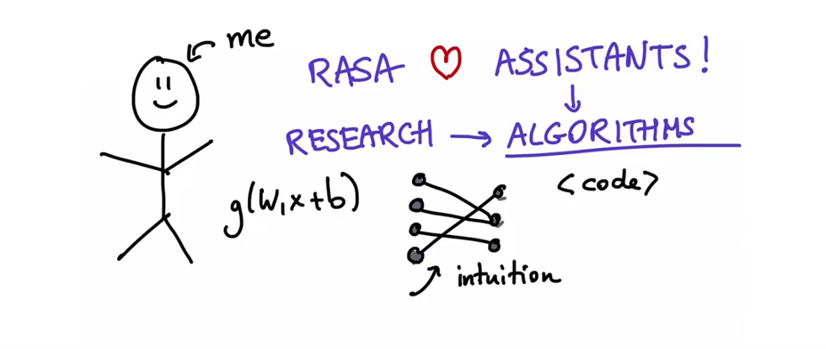
</a>

This is where we share notebooks and projects used in our [youtube channel](https://www.youtube.com/watch?v=wWNMST6t1TA&list=PL75e0qA87dlG-za8eLI6t0_Pbxafk-cxb).

<a href="https://www.youtube.com/watch?v=vWStcJDuOUk&list=PL75e0qA87dlG-za8eLI6t0_Pbxafk-cxb">
    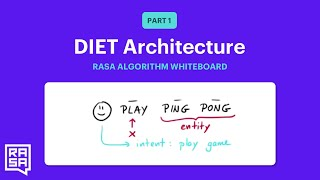
</a>

## Video 1: [DIET Architecture - How it Works](https://www.youtube.com/watch?v=vWStcJDuOUk&list=PL75e0qA87dlG-za8eLI6t0_Pbxafk-cxb)

This video explains the parts of the DIET architecture. It does not discuss any code.

<a href="https://www.youtube.com/watch?v=KUGGuJ0aTL8&list=PL75e0qA87dlG-za8eLI6t0_Pbxafk-cxb">
    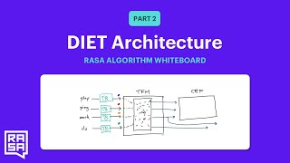
</a>

## Video 2: [DIET Architecture - Design Decisions](https://www.youtube.com/watch?v=KUGGuJ0aTL8&list=PL75e0qA87dlG-za8eLI6t0_Pbxafk-cxb)

This video explains the parts of the DIET architecture. It does not discuss any code.

<a href="https://www.youtube.com/watch?v=oj5oPGDlep4&list=PL75e0qA87dlG-za8eLI6t0_Pbxafk-cxb">
    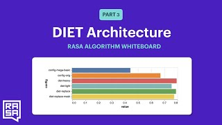
</a>

## Video 3: [DIET Architecture - Benchmarks](https://www.youtube.com/watch?v=oj5oPGDlep4&list=PL75e0qA87dlG-za8eLI6t0_Pbxafk-cxb)

In this video we make changes to a configuration file. The configuration files, the streamlit application as well as an instructions manual can be found in the `diet` folder.

<a href="https://www.youtube.com/watch?v=mWvnlVw_LiY&list=PL75e0qA87dlG-za8eLI6t0_Pbxafk-cxb">
    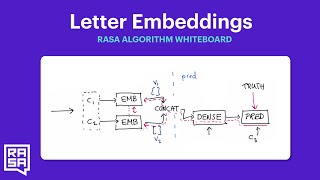
</a>

## Video 4: [Word Embeddings - Letter Embeddings](https://www.youtube.com/watch?v=mWvnlVw_LiY&list=PL75e0qA87dlG-za8eLI6t0_Pbxafk-cxb)

In this video we demonstrate how to train letter embeddings in order to gain intuition on what word embeddings are. 

The kaggle dataset that we use in this video can be found [here](https://www.kaggle.com/therohk/million-headlines).

We've added the two notebooks in this repo in the `letter-embeddings` folder. But you can also run them yourself in google colab. The notebooks are mostly identical but the `v1` notebook only uses one token to predict the next one while `v2` uses two tokens to predict the next one.

Notebook with one token input:  

Notebook with two token input: 

<a href="https://www.youtube.com/watch?v=BWaHLmG1lak&list=PL75e0qA87dlG-za8eLI6t0_Pbxafk-cxb&index=6">
    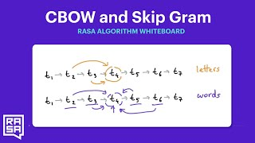
</a>

## Video 5: [Word Embeddings - CBOW & SkipGram](https://www.youtube.com/watch?v=BWaHLmG1lak&list=PL75e0qA87dlG-za8eLI6t0_Pbxafk-cxb&index=6)

This video explains two algorithms but it does not discuss any code.

 

<a href="https://www.youtube.com/watch?v=BWaHLmG1lak&list=PL75e0qA87dlG-za8eLI6t0_Pbxafk-cxb&index=6">
    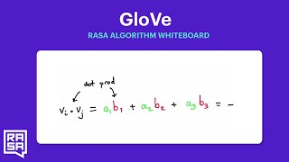
</a>

## Video 6: [Word Embeddings - GloVe](https://www.youtube.com/watch?v=BWaHLmG1lak&list=PL75e0qA87dlG-za8eLI6t0_Pbxafk-cxb&index=7)

This video discusses GloVe but also offers code to train a variant of your own. The keras model can be found in the `glove` folder.
The `glove.py` file contains just the keras algorithm while the notebook contains the full code. You can also go online to colab 
and play with the full notebook from there.

The full notebook: 

<a href="https://www.youtube.com/watch?v=FwkwC7IJWO0&list=PL75e0qA87dlG-za8eLI6t0_Pbxafk-cxb&index=9">
    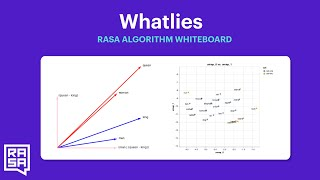
</a>

## Video 7: [Word Embeddings - WhatLies](https://www.youtube.com/watch?v=FwkwC7IJWO0&list=PL75e0qA87dlG-za8eLI6t0_Pbxafk-cxb&index=9)

This video discusses a small visualisation package we've open sourced. The documentation for it can be found [here](https://rasahq.github.io/whatlies/).

The notebook that we made in this video can be found in the `whatlies` folder.

<a href="https://www.youtube.com/watch?v=FwkwC7IJWO0&list=PL75e0qA87dlG-za8eLI6t0_Pbxafk-cxb&index=9">
    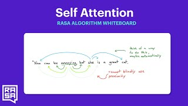
</a>

## Video 8: [Attention - Self Attention](https://www.youtube.com/watch?v=yGTUuEx3GkA&list=PL75e0qA87dlG-za8eLI6t0_Pbxafk-cxb&index=9)

This video discusses the idea behind attention (you may notice some similarities
with a convolution) but it does not discuss any code.

<a href="https://www.youtube.com/watch?v=FwkwC7IJWO0&list=PL75e0qA87dlG-za8eLI6t0_Pbxafk-cxb&index=9">
    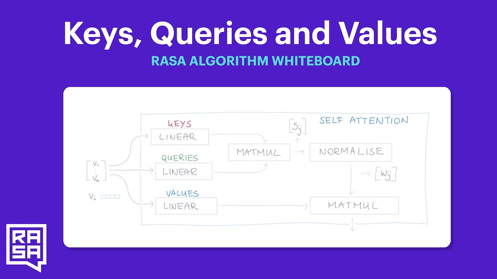
</a>

## Video 9: [Attention: Keys, Values, Queries](https://www.youtube.com/watch?v=tIvKXrEDMhk&list=PL75e0qA87dlG-za8eLI6t0_Pbxafk-cxb&index=11)

This video discusses how you can add more context to the self attention mechanism by introducing layers. This video does not discuss any code though.

<a href="https://www.youtube.com/watch?v=tIvKXrEDMhk&list=PL75e0qA87dlG-za8eLI6t0_Pbxafk-cxb&index=11">
    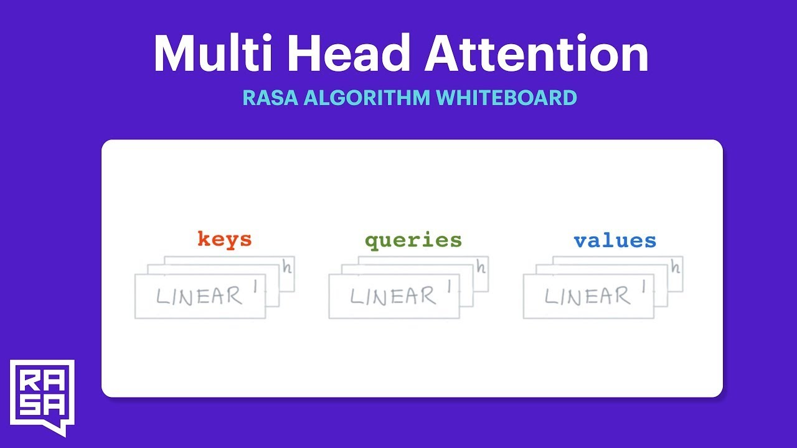
</a>    

## Video 10: [Attention: Multi Head Attention](https://www.youtube.com/watch?v=23XUv0T9L5c&list=PL75e0qA87dlG-za8eLI6t0_Pbxafk-cxb&index=12)

This video explains how you can increase the potential of attention by introducing multiple layers of keys, queries and values. The video does not discuss any code though.

<a href="https://www.youtube.com/watch?v=23XUv0T9L5c&list=PL75e0qA87dlG-za8eLI6t0_Pbxafk-cxb&index=12">
    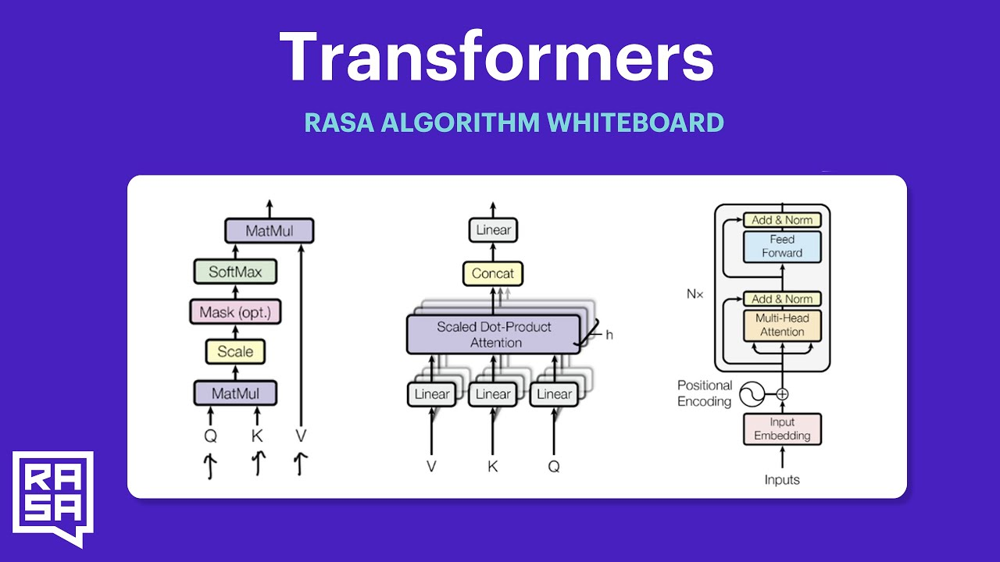
</a>

## Video 11: [Attention: Transformers](https://www.youtube.com/watch?v=EXNBy8G43MM&list=PL75e0qA87dlG-za8eLI6t0_Pbxafk-cxb&index=13)

Given the lessons from the previous videos, this video wraps everything together by 
combining everything into a transformer block. There is no code for this video.

<a href="https://www.youtube.com/watch?v=EXNBy8G43MM&list=PL75e0qA87dlG-za8eLI6t0_Pbxafk-cxb&index=13">
    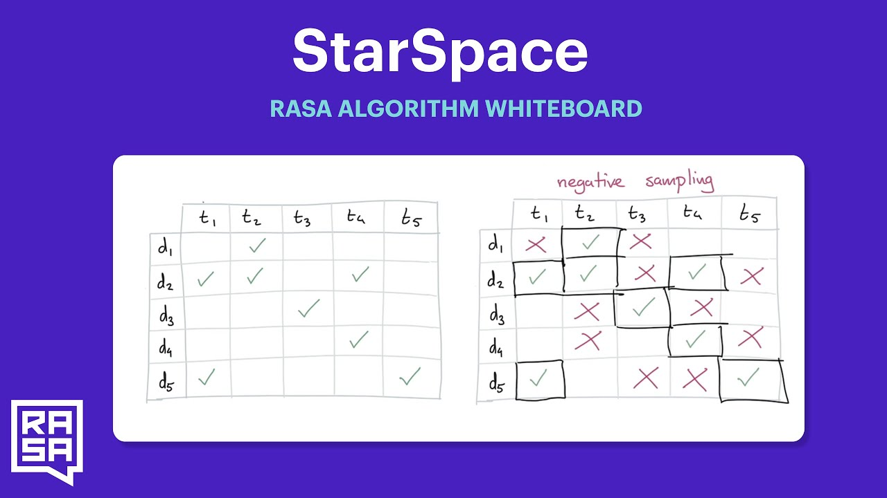
</a>

## Video 12: [StarSpace](https://www.youtube.com/watch?v=ZT3_9Kjx7oI&list=PL75e0qA87dlG-za8eLI6t0_Pbxafk-cxb&index=14)

This video discusses the [StarSpace](https://arxiv.org/abs/1709.03856) algorithm. The
video serves as an introduction to the TED policy. This video contains no code.

 

## Video 13: [TED Policy](https://www.youtube.com/watch?v=j90NvurJI4I&list=PL75e0qA87dlG-za8eLI6t0_Pbxafk-cxb&index=14)

This video only discusses the theory behind the TED algorithm. The next video will
show how TED more on a practical level. This video contains no code.

<a href="https://www.youtube.com/watch?v=d8JMJMvErSg&list=PL75e0qA87dlG-za8eLI6t0_Pbxafk-cxb&index=15">
    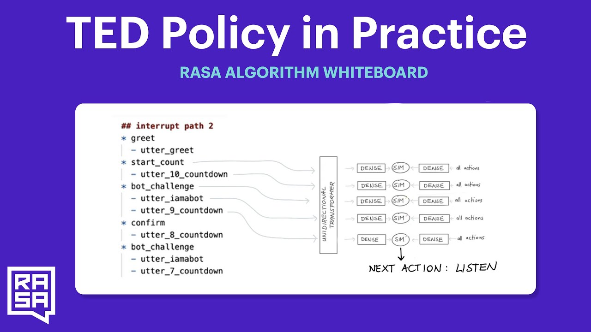
</a>

## Video 14: [TED Policy in Practice](https://www.youtube.com/watch?v=d8JMJMvErSg&list=PL75e0qA87dlG-za8eLI6t0_Pbxafk-cxb&index=15)

This video makes use of a rasa project that can be found [here](https://github.com/RasaHQ/rasa-ted-demo). By tuning the `history` hyperparameter we see how the chatbot is able
to deal with context switches over a long period in the dialogue.

<a href="https://www.youtube.com/watch?v=2jvyWngHEJM&list=PL75e0qA87dlG-za8eLI6t0_Pbxafk-cxb&index=16">
    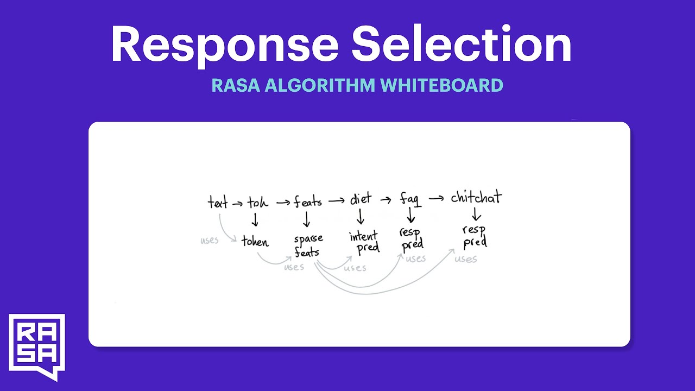
</a>

## Video 15: [Response Selection](https://www.youtube.com/watch?v=2jvyWngHEJM&list=PL75e0qA87dlG-za8eLI6t0_Pbxafk-cxb&index=16)

This video explains how a response selection model might make your model more accurate in a FAQ/Chitchat scenario. There is no code for this video.

<a href="https://www.youtube.com/watch?v=0tXkFScW0hE&list=PL75e0qA87dlG-za8eLI6t0_Pbxafk-cxb&index=17">
    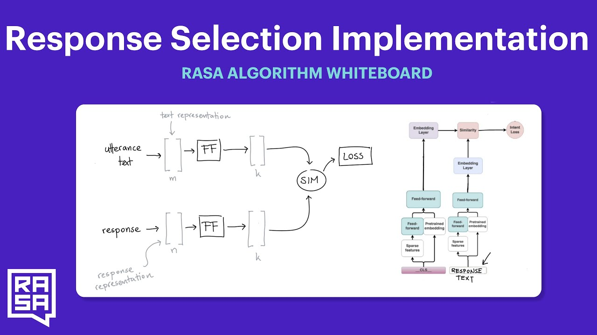
</a>

## Video 16: [Response Selection](https://www.youtube.com/watch?v=0tXkFScW0hE&list=PL75e0qA87dlG-za8eLI6t0_Pbxafk-cxb&index=17)

This video explains how a response selection model is implemented internally. There is no code for this video.

 

<a href="https://www.youtube.com/watch?v=Ju7l5ADg10U&list=PL75e0qA87dlG-za8eLI6t0_Pbxafk-cxb&index=18">
    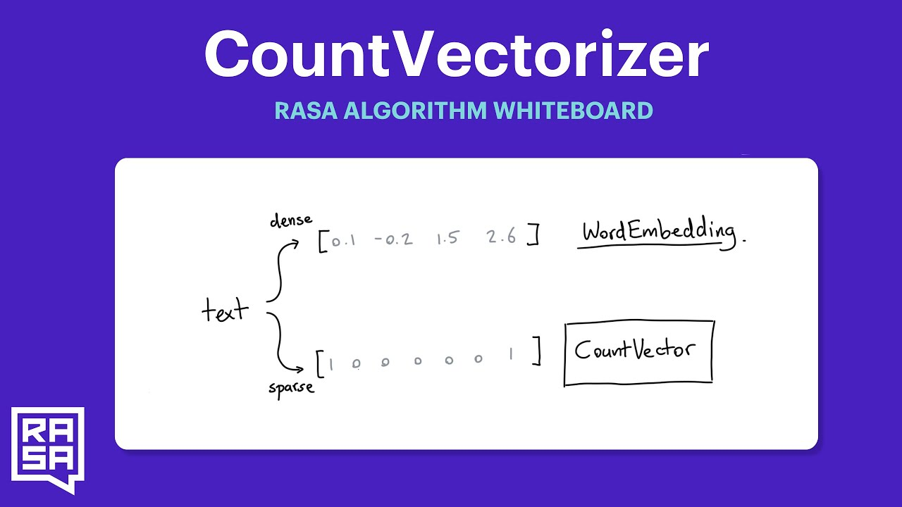
</a>

## Video 17: [CountVectors](https://www.youtube.com/watch?v=Ju7l5ADg10U&list=PL75e0qA87dlG-za8eLI6t0_Pbxafk-cxb&index=18)

This video explains why CountVectors are still the unsung hero of natural language processing. There is no code attachment for this video.

 

<a href="https://www.youtube.com/watch?v=kNw9dpzp5RU&list=PL75e0qA87dlG-za8eLI6t0_Pbxafk-cxb&index=19">
    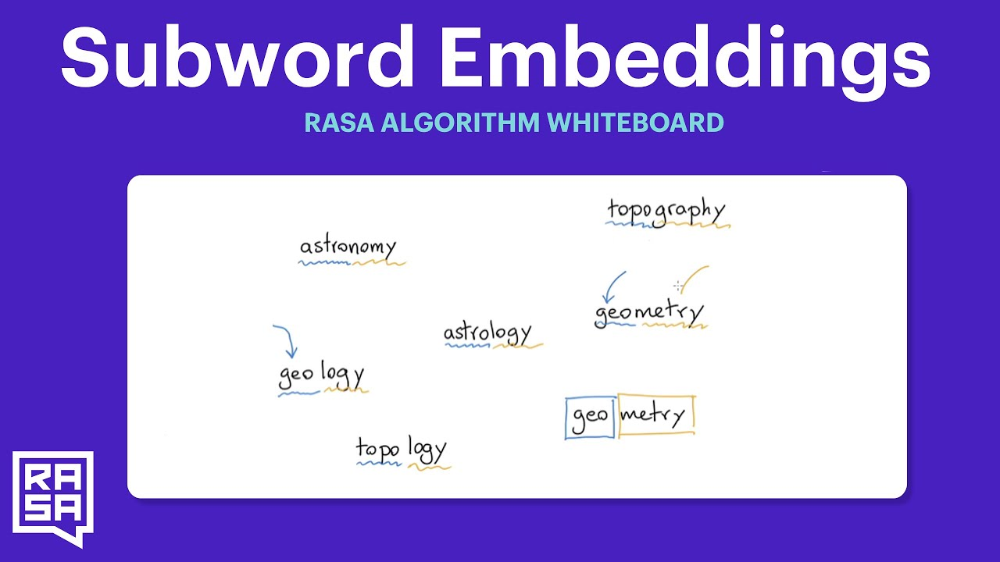
</a>

## Video 18: [Subword Embeddings](https://www.youtube.com/watch?v=kNw9dpzp5RU&list=PL75e0qA87dlG-za8eLI6t0_Pbxafk-cxb&index=19)

This video tries to combine the ideas from word embeddings with the idea of countvectors. To reproduce, check out [whatlies](https://rasahq.github.io/whatlies/).

<a href="https://www.youtube.com/watch?v=8D3Gamk1Jig&list=PL75e0qA87dlG-za8eLI6t0_Pbxafk-cxb&index=20">
    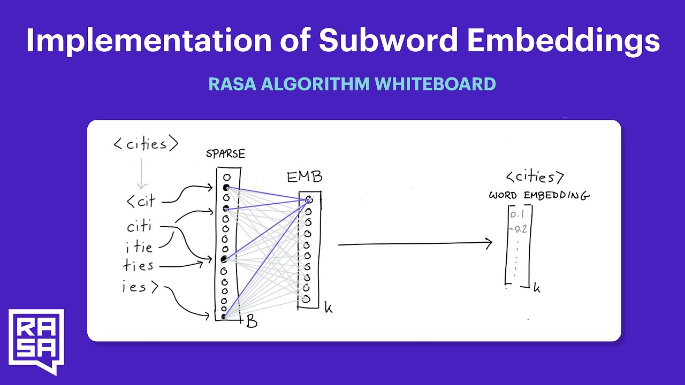
</a>

## Video 19: [Subword Implementation](https://www.youtube.com/watch?v=8D3Gamk1Jig&list=PL75e0qA87dlG-za8eLI6t0_Pbxafk-cxb&index=20)

This video explains how you might implement subword embeddings from a neural network design perspective. There is no code for this video.

## Video 20: [BytePair Embeddings](https://www.youtube.com/watch?v=-0IjF-7OB3s&list=PL75e0qA87dlG-za8eLI6t0_Pbxafk-cxb&index=21)

This video explains how BytePair embeddings work. If you want to use these embeddings in Rasa please check out [rasa-nlu-examples](https://rasahq.github.io/rasa-nlu-examples/).

<a href="https://www.youtube.com/watch?v=e9JdIKgf0QY&list=PL75e0qA87dlG-za8eLI6t0_Pbxafk-cxb&index=22">
    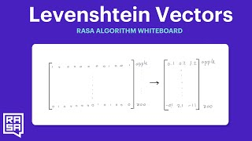
</a>

## Video 21: [Levenshtein Vectors](https://www.youtube.com/watch?v=e9JdIKgf0QY&list=PL75e0qA87dlG-za8eLI6t0_Pbxafk-cxb&index=22)

This video explains how count vector mights be turned from sparse into dense layers. While doing this, we also learn that these vectors also encode levensthein distance.

<a href="https://www.youtube.com/watch?v=UwAvyACOrWs&list=PL75e0qA87dlG-za8eLI6t0_Pbxafk-cxb&index=23">
    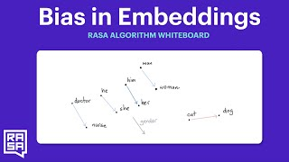
</a>

## Video 22: [Bias in Word Embeddings](https://www.youtube.com/watch?v=UwAvyACOrWs&list=PL75e0qA87dlG-za8eLI6t0_Pbxafk-cxb&index=23)

This video explains how you might measure gender bias in word embeddings. It's part of a larger series and the code for it can be found in the `bias` folder of this repository.

<a href="https://www.youtube.com/watch?v=8xQbWlCEHRw&list=PL75e0qA87dlG-za8eLI6t0_Pbxafk-cxb&index=24">
    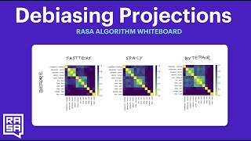
</a>

## Video 23: [De-Biasing Projections](https://www.youtube.com/watch?v=8xQbWlCEHRw&list=PL75e0qA87dlG-za8eLI6t0_Pbxafk-cxb&index=24)

There's a lot of research on how we might remove bias from word-embeddings. In this video we'll discuss one such technique. For the code, check the `bias` folder of this repository.

<a href="https://www.youtube.com/watch?v=MHdAd48dANo&list=PL75e0qA87dlG-za8eLI6t0_Pbxafk-cxb&index=25">
    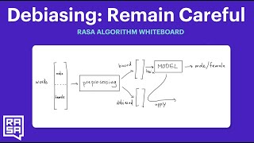
</a>

## Video 24: [Remain Careful with Debiasing](https://www.youtube.com/watch?v=MHdAd48dANo&list=PL75e0qA87dlG-za8eLI6t0_Pbxafk-cxb&index=25)

In this video we explain why de-biasing techniques have limits. For the code, check the `bias` folder of this repository.

<a href="https://www.youtube.com/watch?v=2ROP1QFKsqc&list=PL75e0qA87dlG-za8eLI6t0_Pbxafk-cxb&index=26">
    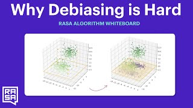
</a>

## Video 25: [Why Debiasing is Hard](https://www.youtube.com/watch?v=2ROP1QFKsqc&list=PL75e0qA87dlG-za8eLI6t0_Pbxafk-cxb&index=26)

In this video we explain why de-biasing techniques have limits. For the code, check the `bias` folder of this repository.

<a href="https://www.youtube.com/watch?v=u6EmngzBUEU&list=PL75e0qA87dlG-za8eLI6t0_Pbxafk-cxb&index=27">
    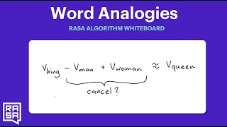
</a>

## Video 26: [Word Analogies](https://www.youtube.com/watch?v=u6EmngzBUEU&list=PL75e0qA87dlG-za8eLI6t0_Pbxafk-cxb&index=27)

In this video we explain why "word analogies" don't really work by merely applying arithmetic on word-vectors. For the code, check the `analogies` folder of this repository.

<a href="https://www.youtube.com/watch?v=Czto6GzJah8&feature=youtu.be&ab_channel=Rasa">
    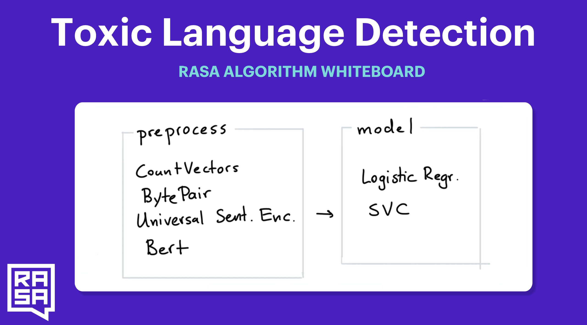
</a>

## Video 27: [Toxic Language](https://www.youtube.com/watch?v=Czto6GzJah8&feature=youtu.be&ab_channel=Rasa)

In this video we explain why detecting toxic language is harder than it might seem. Code for the video can be found in the `toxic` folder in this repository.

<a href="https://www.youtube.com/watch?v=byy19WPLPBQ&list=PL75e0qA87dlG-za8eLI6t0_Pbxafk-cxb&index=34">
    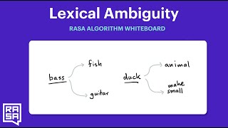
</a>

## Video 28: [Lexical Ambiguity](https://www.youtube.com/watch?v=byy19WPLPBQ&list=PL75e0qA87dlG-za8eLI6t0_Pbxafk-cxb&index=34)

In this video we explain why detecting, in general, NLP models fall short. Models don't *really* understand language, they merely model it.

<a href="https://www.youtube.com/watch?v=VldHznqAYlE&list=PL75e0qA87dlG-za8eLI6t0_Pbxafk-cxb&index=35">
    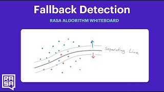
</a>

## Video 29: [Fallback Detection](https://www.youtube.com/watch?v=VldHznqAYlE&list=PL75e0qA87dlG-za8eLI6t0_Pbxafk-cxb&index=35)

It's important to understand the limits of our models. They can sometimes tell us when they're uncertain about a prediction and this information should not be ignored.

<a href="https://www.youtube.com/watch?v=Z0pnQcWHBZE&list=PL75e0qA87dlG-za8eLI6t0_Pbxafk-cxb&index=36">
    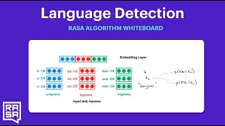
</a>

## Video 30: [Language Detection](https://www.youtube.com/watch?v=Z0pnQcWHBZE&list=PL75e0qA87dlG-za8eLI6t0_Pbxafk-cxb&index=36)

What might an assistant do if it sees a text from a language that it isn't trained on? It might make assumptions because it's unlike anything it has seen before and a standard fallback mechanism might not be able to pick it up.

For the code, check the `language` folder of this repository.

<a href="https://www.youtube.com/watch?v=FipRjQRaCz8&list=PL75e0qA87dlG-za8eLI6t0_Pbxafk-cxb&index=37">
    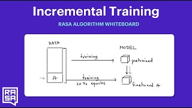
</a>

## Video 31: [Incremental Training](https://www.youtube.com/watch?v=FipRjQRaCz8&list=PL75e0qA87dlG-za8eLI6t0_Pbxafk-cxb&index=37)

Sometimes we don't need to completely retrain our algorithms. At times we can just finetune on new data. In this video we explain how that might be done with DIET.

<a href="https://www.youtube.com/watch?v=T0dDetqgra4&list=PL75e0qA87dlG-za8eLI6t0_Pbxafk-cxb&index=38">
    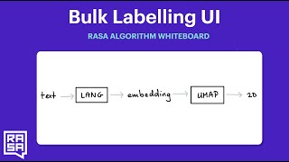
</a>

## Video 31: [Bulk Labelling UI](https://www.youtube.com/watch?v=T0dDetqgra4&list=PL75e0qA87dlG-za8eLI6t0_Pbxafk-cxb&index=38)

This video demonstrates a new feature in our bulk labelling demo. The code can be found [here](https://github.com/RasaHQ/rasalit/tree/main/notebooks/bulk-labelling). 

<a href="https://www.youtube.com/watch?v=7tAWk_Coj-s&list=PL75e0qA87dlG-za8eLI6t0_Pbxafk-cxb&index=39">
    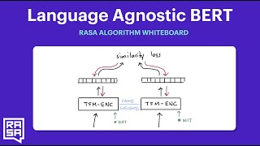
</a>

## Video 32: [Language Agnostic BERT (LaBSE)](https://www.youtube.com/watch?v=7tAWk_Coj-s&list=PL75e0qA87dlG-za8eLI6t0_Pbxafk-cxb&index=39)

In this episode, I'll discuss how you might tweak the standard BERT model to accommodate multiple languages at the same time. We'll also demonstrate a pre-trained model that you can use right away! If you're interested in the paper, you can find it [here](https://arxiv.org/abs/2007.01852).

## Video 33: [Iterate on Data](https://www.youtube.com/watch?v=xpm17ibm0E8&list=PL75e0qA87dlG-za8eLI6t0_Pbxafk-cxb&index=40)

Instead of debugging a model, it might be *much* more effective to consider debugging your data. In this video, we'll discuss some techniques that you can start with while also demonstrating some new features in Rasa X.

## Video 34: [Meaningful Benchmarks](https://www.youtube.com/watch?v=GTClb8RQSGM&list=PL75e0qA87dlG-za8eLI6t0_Pbxafk-cxb&index=41)

It's easy to get distracted when you go down the rabbit hole of performance statistics. But! Not every impressive benchmark is meaningful and it's important to make the distinction. In this video, we're going to explore one benchmark to demonstrate what we mean by this. The code for this can be found in the `intent-benchmark` folder.

<a href="https://www.youtube.com/watch?v=ev1tNXPo3tE&list=PL75e0qA87dlG-za8eLI6t0_Pbxafk-cxb&index=42">
    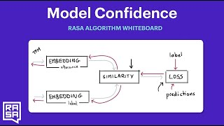
</a>

## Video 35: [Model Confidence](https://www.youtube.com/watch?v=ev1tNXPo3tE&list=PL75e0qA87dlG-za8eLI6t0_Pbxafk-cxb&index=42)

If we're going to apply a fallback, we better make sure that we have a good measure for confidence. In this video we explain an update that we've made to DIET that makes the confidence measure a more representative number.

<a href="https://www.youtube.com/watch?v=IHHKrqgFgs4&list=PL75e0qA87dlG-za8eLI6t0_Pbxafk-cxb&index=43">
    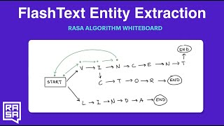
</a>

## Video 36: [FlashText Entity Extraction](https://www.youtube.com/watch?v=IHHKrqgFgs4&list=PL75e0qA87dlG-za8eLI6t0_Pbxafk-cxb&index=43)

If we're going to apply a fallback, we better make sure that we have a good measure for confidence. In this video we explain an update that we've made to DIET that makes the confidence measure a more representative number.
